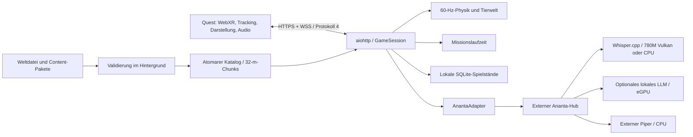

# Architektur

Orbit ist ein lokales Client/Server-Spiel. Die Quest rendert echte stereoskopische 3D-Geometrie mit Three.js/WebXR. Kopf-, Hand- und Controllerbewegungen werden im Browser unmittelbar angezeigt. Der Laptop liefert simulierte Zustände und Weltänderungen. Es werden keine gerenderten PC-Videobilder übertragen.

## Prozesse und Zuständigkeit

Ein Python-Prozess bedient statische Clientdateien, HTTP-Audio und WebSockets. Jeder Browser hat eine eigene `GameSession` mit `Expedition`, `MissionRuntime`, Charaktergespräch und Spielstand. Vier Sitzungen sind als technische Obergrenze zugelassen; sie spielen bisher getrennte Welten, keine gemeinsame Multiplayer-Simulation. Terrain und Paketkatalog werden pro Server geteilt. Speech/LLM laufen optional in separaten Diensten.

`networking/http.py` setzt Komponenten zusammen und behandelt Transport/Lebenszyklus. `networking/session.py` prüft räumliche Interaktionen und verbindet Domänen. `physics` enthält Ballistik/Flug, `entities` Wildtiere und Missionsziele, `world` Terrain und Streaming. `missions` kennt weder Browser noch HTTP. `persistence`, `learning`, `fitness`, `ai` und `speech` können unabhängig erweitert werden. Die schmalen Ports und versionierten Verträge sind die Übergabepunkte für Entwickler und Coding-Agenten.

## Zeit und Netzwerk

Physik läuft in Schritten von 1/60 Sekunde. Zustandsbilder kommen mit 30 Hz, Missionsobjekte/Ziele mit 10 Hz. Ein begrenzter Akkumulator verhindert unendliches Aufholen nach langen Pausen. Kopftracking benötigt keinen Netzwerk-Roundtrip. Bewegungsabsichten werden lokal vorhergesagt und anhand von `moveAck` mit dem Server abgeglichen; der Server begrenzt Bewegungszeit, Richtung, Geschwindigkeit und Sequenzen. Andere Entitäten werden interpoliert. Pfeile verwenden relative Swept-Collision gegen bewegte Kollisionskörper.

Senden an langsame Clients hat ein Zeitlimit; es entsteht keine unbeschränkte Warteschlange alter Snapshots. Eingänge sind auf 2 KiB, 60 Nachrichten pro Sekunde und ein geschlossenes JSON-Schema begrenzt. WebSocket und Aufnahme-POST benötigen dieselbe Origin wie die Spielseite. Ein Browserprofil kann nur eine aktive Sitzung öffnen. Details: [Protokoll](docs/protocols/websocket.md).

## Simulation und Welt

Der Seed und feste Physikschritte machen zentrale Berechnungen reproduzierbar. Eingangszeiten und Sequenzen gehören bei späterem Replay ausdrücklich mit ins Protokoll; bisher gibt es keinen vollständigen Replay-Rekorder. Die Welt lädt ungefähr 32 × 32 Meter große Chunks, mit detaillierten nahen und vereinfachten äußeren Bereichen. Cache, Sichtbereich und Objektzahlen sind begrenzt. Neue Inselbereiche entstehen beim Bewegen deterministisch auf dem Laptop.

`content/core/world.json` kann während einer Sitzung geändert werden. Der Hintergrund-Watcher baut einen Kandidaten; nur ein gültiger Kandidat wird im Eventloop übernommen. Das bestehende Terrain bleibt bei Fehlern aktiv. Nahe Details weichen bei großer Flughöhe einem vereinfachten Globus. Die aktuelle Planetensicht ist eine Übersicht derselben Höhenfunktion, noch keine durchgehend sphärische Physikwelt.

## Content-Lebenszyklus

Sieben JSON-Dateien bilden eine Episode. Geschlossene Draft-2020-12-Schemas prüfen die Form; der Loader prüft Referenzen, Capabilities, Abhängigkeiten, IDs, Dateigrenzen und Größen. Content kann keine Funktionen, Skripte, Ausdrücke oder Netzwerkziele definieren. Ein Paketobjekt speichert kanonische JSON-Bytes und SHA-256 unveränderlich.

Der Watcher validiert einen vollständigen Katalog im Hintergrund und aktiviert ihn atomar. Unveränderte Versionsnummer bei verändertem Inhalt ist ein Fehler. Eine laufende Mission hält ihr bisheriges Paketobjekt; die nächste neue Mission nimmt den neuen Katalogstand. Nach einem Serverneustart ist Resume nur mit identischer ID, Version und Prüfsumme möglich. Ein dauerhaftes Archiv mehrerer Paketversionen ist ein eigener Roadmap-Punkt.

Episoden bestehen aus Stufen mit `all`/`any`-Zielen. Nur bestätigte Domänenereignisse ändern Fortschritt. Ein Client darf `interact` senden, aber keinen Erfolg oder Treffer behaupten. `GameSession` prüft Entfernung, Spielphase, Objekt, Verb, Inventar und aktuelle Stufe. Pfeiltreffer entstehen ausschließlich im Solver. Die Runtime meldet Lernbeobachtungen und Belohnungen. Die drei mitgelieferten Episoden sind kompakte spielbare Mechanikbeispiele; ihre vollständige 15-Minuten-Ausgestaltung folgt später.

## KI und Sprache

Quest-Aufnahme → Orbit → externer Ananta-Hub → Whisper → Dialogplanung/Jev-Modell → Text → TTS → Quest. Dialog und TTS sind asynchron; ein unterbrochenes Gespräch wird verworfen. Offline verfasst Orbit keine angebliche Modellantwort: Arin benutzt gekennzeichnete Autorentexte. Das Ananta-Orakel nutzt zunächst deterministische Hinweise aus dem Paket.

`DialogueProvider`, `SpeechRecognizer`, `SpeechSynthesizer` beschreiben die Ports. Adapter existieren für den vorhandenen Ananta-`game-dragon`-Vertrag, Whisper.cpp-WAV-HTTP und Piper-HTTP. `FallbackRecognizer` kann einen separat konfigurierten CPU-Dienst verwenden. GPU-Auswahl ist Aufgabe des externen Whisper-Prozesses, nicht des Quest-Clients. [Pipeline](docs/ai/speech.md), [Kontextgrenzen](docs/ai/context-and-actions.md).

Arins Gespräch ist in jeder aktiven Spielphase erreichbar: am Boden, im Flug und in MR. Pause, Neustart und Sitzungswechsel brechen ausstehende Antworten ab; verspäteter Text oder Ton wird verworfen. Das lokale Kontextmodell unterscheidet Erkunden, Flug und MR. Der bestehende externe `game-dragon`-Adapter übermittelt weiterhin nur seinen freigegebenen Ausschnitt; eine Erweiterung des Ananta-Vertrags wird dadurch nicht behauptet.

`CompanionMotion` berechnet ausschließlich Arins sichtbare Begleiterpose auf geladenem Terrain. Die Klasse ändert weder den Spieler noch die Kamera und entscheidet keine Kollisionen, Missionen oder Belohnungen. `DragonAnimation` mischt die Originalclips des CC0-Modells und begrenzte Flug-/Blick-/Sprechgesten pro Instanz. Eigene veröffentlichte Kreaturen behalten ihren separaten Animationspfad. Grenzen und spätere Navigation: [ADR 007](docs/architecture/adr/007-ground-companion.md).

## Kreaturenwerkstatt

`client/webxr/src/design` ist eine eigene XR-Szene mit Auswahl, Formung, Malen und Vorschau. `server/orbit_server/design` validiert Commands, berechnet Geometrie in begrenzten, abbrechbaren Prozessen und speichert autoritative Revisionen in einer separaten `creatures.sqlite3`. Optionales Python-Extra: `design`.

Der kanonische Master besteht aus Dreiecksregionen in Metern. NumPy verarbeitet lokale Werkzeuge, Manifold geschlossene Volumen und trimesh die Analyse. WebSocket-Protokoll 1 über `/api/design/ws` überträgt geänderte Vertexwerte oder einzelne neue Topologieregionen. SQLite-CAS und Command-Belege schützen gegen doppelte Änderungen; IndexedDB hält einen unbestätigten Clientbefehl für Reconnect bereit.

Ein KI-Vorschlag bleibt ein Kandidat bis zur expliziten Annahme. Anantas separater `/api/game-dragon/design`-Adapter plant lokale Werkzeuge oder Parameter einer bekannten Kreaturenvorlage; Orbit prüft Auswahl, Masken und Geometrie erneut. Ein eigener Meshoptimizer-Prozess reduziert indexbasiert die Geometrie und erhält Skin/Clips; das Ergebnis verwendet denselben Vorschau-/Undo-Pfad. Sparse Ebenen speichern additive Positions-/Farb-/Materialänderungen. Topologieänderungen erfordern vorheriges explizites Zusammenfassen. Design-Kontext, lokale Tool-Allowlist und Masken sind unabhängig vom Game-Dragon-Dialogvertrag. Spiel- und Designzustände bleiben getrennt. [Repräsentation](docs/architecture/adr/design-001-editing-foundation.md), [Revisionen/Transport](docs/architecture/adr/design-002-protocol-and-storage.md), [aktuelle Grenzen](docs/design-mode/overview.md).

Veröffentlichung erzeugt ein separates SHA-256-adressiertes Runtime-Artefakt mit Asset-ID und exakter Revision. Pro Browserprofil wird ein Reittier gewählt; bestehende Sitzungen pinnen ihren Stand. `/ws?test_asset=<hash>` öffnet eine separate Sitzung ohne reguläres Laden/Speichern von Spielständen. Der Client prüft Hash und Revision, teilt unveränderliche GPU-Geometrie und erstellt pro Instanz ein eigenes Skelett. Fehler behalten die vorherige Figur. [Veröffentlichungsvertrag](docs/design-mode/publication.md).

## Open Asset Resolver

`server/orbit_server/assets` ist die gemeinsame Asset-Domäne für Spiel, Werkstatt und modellunabhängige Tool-Harnesses. Provider liefern normalisierte Metadaten und begrenzte Downloadmanifeste. Lizenzpolitik, HTTPS-/Archivgrenzen, SHA-256-Blobs und der profilgebundene SQLite-Katalog liegen hinter eigenen Schnittstellen. CPU-/Bildverarbeitung läuft in abbrechbaren lokalen Node-Prozessen mit glTF Transform, Khronos Validator, Sharp und dem vorhandenen meshoptimizer. Unter Linux kann der Prozess zusätzlich durch `bwrap` isoliert werden.

`client/webxr/src/assets` enthält den Asset-Browser, GLB-Instanzen und allgemeine Weltplatzierungen. Unveränderliche Geometrie kann geteilt werden; Skeletons, Materialien und Mixer gehören pro Instanz. Neue Objekte sind ausdrücklich deklarative Dekoration; Gameplay-Autorität und Missionen bleiben im vorhandenen Server. Die Werkstatt erhält eine unabhängige Bearbeitungskopie mit Quellenbindung und weist nicht verlustfrei unterstützte Daten zurück. Buildreferenzen erzeugen automatisch Herkunftsmanifest und Credits. [ADR 008](docs/architecture/adr/008-open-asset-resolver.md) · [Vertrag und Pipeline](docs/assets/resolver.md).

## Spielstand und Anpassung

SQLite schreibt validierte JSON-Spielstände atomar, regelmäßig und beim Sitzungsende. Der HttpOnly/SameSite-Cookie identifiziert ein lokales Browserprofil; er ist kein Cloud-Konto. Gespeichert werden Missions- und Lernfortschritt, Entdeckungen, Arins Erinnerungen/Beziehung, Einstellungen, Lösungswege, Achsenbeobachtungen und exakte Paketversionen. Unbekannte Save-Schemas werden abgelehnt und nicht überschrieben. Inventar und aktuelle Stufe können fortgesetzt werden.

Körper/Geschick/Geist sind Beobachtungskategorien, keine RPG-Level oder Diagnosen. Adaptive Empfehlungen sind vorbereitet, ändern derzeit keine Einstellung automatisch. Fitnessprofil und Schwierigkeit sind manuell wählbar. Mikrofon-Rohdaten und freie Antworten werden nicht in Lerntelemetrie oder Spielständen archiviert.
